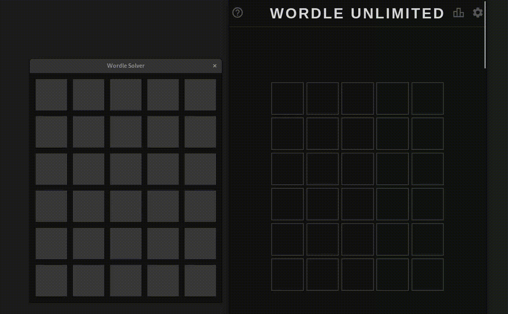

# Wordle solver

## Install
### Linux assuming you have a C compiler (probably also works with Mac using clang and Windows using mingw)
If you want the program to use multiple thread:
```bash
CFLAGS='-fopenmp -lgomp -O3 -march=native' pip install .
```
Otherwise:
```bash
pip install .
```

### Windows using msvc (probably)
```cmd
SET CL=/openmp /Ox
pip install .
```
Where the first command is optional but will probably speed up execution

With any luck, you'll see a window like "Wordle Solver"  below (just type the words into the screen and hit enter to generate the next word):



Note that if you choose a first like "QAJAQ" and it results in all grey squares, it may take a while (e.g. tens of seconds) to compute the next best word.

If your starting word is "ZZZZZ" (obviously not valid in standard wordle) then it may take of the order of tens of minutes to compute with 8 threads.
## How it works
### The value function
$$
V(\{w_i\}_{i=1}^{n}) = \begin{cases}
1& \text{if } n = 1\\
\displaystyle 1 + \min_{\text{start words}}\max_{\text{end words}} V(\{w_j\}_{j=1}^{k}) &\text{otherwise}
\end{cases}
$$
Where:

Start words and end-words are the $n^2$ pairs of words from that $n$-word set

$\{w_j\}_{j=1}^{k}$ is the remaining $k$-word subset of the $n$ words that could have produced colours consistent with the colours produced in the end word.

$k$ must be less than $n$ so the recursion will terminate

$V$ is the optimal worst-case game length with $n$-word set $\{w_i\}_{i=1}^{n}$ over games where the guesses chosen must be possible answers given the previous guesses and clues. e.g:
- $V(\{\text{BOUND, FOUND, HOUND, MOUND, POUND, ROUND, SOUND, WOUND}\}) = 8$ because each guess is either the answer or narrows the answer down by just 1 word.
- $V(\text{\{HELLO, WORLD, EARTH\}}) \leq 2$ because guessing "EARTH" will either be correct or will reveal whether there is an "E" in the answer. We know $V(\text{\{HELLO, WORLD, EARTH\}}) > 1$ because $V = 1$ iff there's only 1 word. That means $V(\text{\{HELLO, WORLD, EARTH\}}) = 2$
- The value of the entire answer list is 6 with $\argmin$ starting words such as "FLOWN" and "STORM". This means that this restricted version of wordle (where you must make full use of previous clues) is a solved game for this ~2300-word answer list.


Several optimisations can be made to speed up the search:
- $V$ = 2 when $n=2$ 
- the minimisation lends itself to multi-threading
- for a given guess, there are only $3^5$ different clues that can be given so you only need to maximise over at most $3^5$ different end words
- if in the following matrix $M_{ij}$ is the value starting with word $i$ and ending with word $j$, the red elements don't need to be attempted for calculation. The orange elements can be aborted early. The minimum is given by $M_{21}$. You can abort if you find a value less than or equal to number on the right hand side of the matrix
$$
M =\begin{pmatrix}
1&5&5&5&2\\4&1&2&2&3\\3&\color{orange}4&\color{red}1&\color{red}4&\color{red}4\\\color{orange}5&\color{red}5&\color{red}2&\color{red}1&\color{red}3\\\color{orange}4&\color{red}4&\color{red}5&\color{red}5&\color{red}1
\end{pmatrix}\begin{matrix}\\5\\4\\4\\4\end{matrix}
$$
- If 2 appears on the RHS of a matrix like $M$ above, you can terminate there because a value is only less than 2 if the matrix is $1 \times 1$
- If the matrix is $2 \times 2$, the value is 2
- Shuffling the input data seems to halve the time to check. Sorting by the quality of the word would work even better.